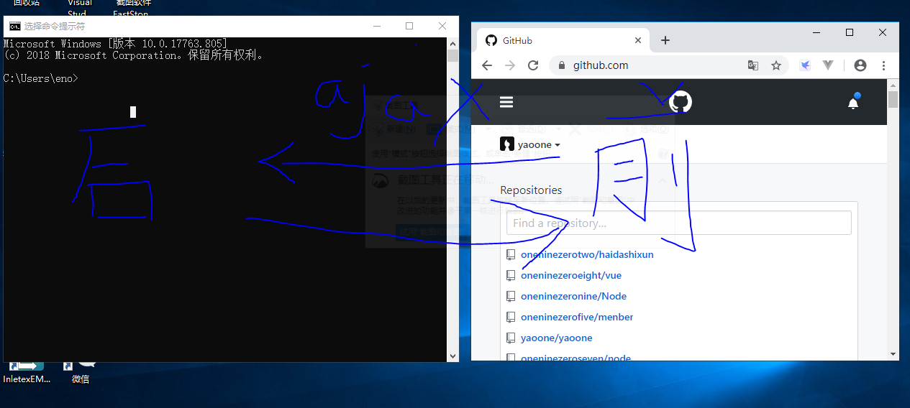

# http模块

创建服务器

- 从浏览器里面输入 https://www.baidu.com/ 浏览器发送请求，默认是Get请求
- 浏览器会构造一个请求的信息(TCP/IP) 协议状态码 报文头报文体(post) post的内容可以比较多
- 百度的服务器 获取你的请求头和请求体，知道客户端的请求信息，然后构造响应头和响应体，发送给前端(四次挥手)


每一次请求，浏览器会把数据放在(请求头或者请求体)，后端获取你的请求信息，构造响应头(状态码，服务器的信息)响应体(真正获取的信息)信息

完整http请求(OSI模型)


客户端逻辑
```js
setInterval(() => {
    var msgLength = document.querySelectorAll('.js_message_plain').length
    var msg = document.querySelectorAll('.js_message_plain')[msgLength - 1].innerText
    var xhr = new XMLHttpRequest();
    xhr.onreadystatechange = () => {
        if (xhr.readyState === 4 && xhr.status === 200) {
            console.log(xhr.responseText)
        }
    }
    // 请求头
    // xhr.setRequestHeader
    xhr.open("GET", `http://localhost:3000?msg=${msg}`, true)
    // 请求体
    xhr.send(null)
}, 1000)
```

服务端的逻辑
```js
const {createServer} = require('http')
const fs = require('fs')
// 创建服务器的方法
// request 请求头和请求体 前端给后端的
// response响应头和响应体 后端给前端的
const server = createServer((request,response)=>{
    console.log(request.url)
    fs.appendFile('./msg.txt',request.url+'\n',()=>{
        console.log('写入成功')
    })
    // 编写响应头
    response.writeHead('202')
    // 编写响应体
    response.write('hello world123')
    // 后端完全写完了
    response.end()
})
// 提供一个端口给前端服务
server.listen(3000)
console.log('启动服务器')
```

下面就是前后端在系统上进行通信的实例

- Node 服务端
- 浏览器 客户端



如果前端往后端发送复杂POST请求，由于POST是把请求的数据放入请求体

请求体可以是图片，音频，视频等格式，我们称之为流格式

你需要用容器把流慢慢接受，然后在做转化
```js
let body = ''
request.on('data',(chunk)=>{
    body+=chunk
})
request.on('end',()=>{
    console.log(body)
})
```

# querystring

querystring 模块提供用于解析和格式化 URL 查询字符串的实用工具。 它可以使用以下方式访问：

我们可以用这个模块解析POST请求体的数据，转化为键值对
```js
const querystring = require('querystring');
```

# 完整处理POST请求的方法

```js
const { createServer } = require('http')
const fs = require('fs')
const querystring = require('querystring')
// 创建服务器的方法
// request 请求头和请求体 前端给后端的
// response响应头和响应体 后端给前端的
// wamp $_POST['xxx']

const parseBody = (request) => {
    return new Promise((resolve, reject) => {
        // 空的容器接受流
        let body = ''
        request.on('data', (chunk) => {
            body += chunk
        })
        request.on('end', () => {
            // 解码
            resolve(querystring.parse(body))

        })
        request.on('error', (err) => {
            reject(err)
        })
    })
}
const server = createServer(async (request, response) => {
    // GET url
    // console.log(request.url)
    // CORS 更改响应头，让浏览器放行
    response.setHeader('Access-Control-Allow-Origin', '*')
    const { username, password } = await parseBody(request)
    console.log(username, password)

    if (username === 'yao' && password === '123') {
        // 编写响应头
        response.writeHead('200')
        // 编写响应体
        response.write('success')

    } else {
        response.write('failure')
    }
    // 后端完全写完了
    response.end()
})
// 提供一个端口给前端服务
server.listen(3000)
console.log('启动服务器')
```

# cluster和os

集群和系统模块，最大化利用cpu的硬件性能，
```js
// 集群模块
const cluster = require('cluster');
// http模块 创建服务器
const http = require('http');
// 系统模块，可以获取CPU的信息
const numCPUs = require('os').cpus().length;

// 判断是否主进程
if (cluster.isMaster) {
    console.log(`主进程 ${process.pid} 正在运行`);

    // 衍生工作进程。
    for (let i = 0; i < numCPUs; i++) {
        //  拷贝8次
        cluster.fork();
    }

    cluster.on('exit', (worker, code, signal) => {
        console.log(`工作进程 ${worker.process.pid} 已退出`);
    });
}
// 工作进程 子进程
else {
    // 工作进程可以共享任何 TCP 连接。
    // 在本例子中，共享的是 HTTP 服务器。
    // 负载均衡
    http.createServer((req, res) => {
        res.setHeader('Content-Type', 'text/html;charset=utf-8')
        res.writeHead(200);
        res.end('你好世界\n');
    }).listen(8000);

    console.log(`工作进程 ${process.pid} 已启动`);
}
```

# path

path处理路径：
```js
const path = require('path');
// 路径合并处理
const result = path.resolve('/foo/bar', '../tmp/file/');
// 算出一个绝对路径
console.log(result);
console.log(__dirname);
// 路径模块
console.log(path.resolve(__dirname, './path.js'))
```