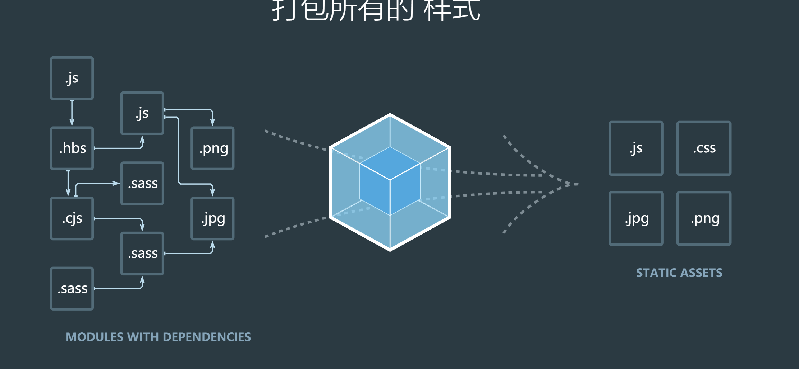

# webpack

webpack自动化构建工具

gulp自动话构建工具

gulp->grunt->webpack

webpack很像gulp，gulp有的webpack都有，gulp倾向于文件的处理，webpack倾向于项目的模块化(第三方npm，内置fs,http，自定义)

模块打包工具，那就是把我们以前用的(第三方npm，内置fs,http，自定义)全部给打包



左边部分(.js(es6),.sass,.jade)打包前的文件（入口）

-webpack->

右边部分(.js(es5),.css,.html) 出口

webpack把左边部分的模块文件打包到右边那些文件的形式

比如我开发的时候用的是sass模块，但是经过webpack会变成css

安装webpack环境，全局安装会在对应的全局文件夹里面生产一个`xxx.cmd`

```js
npm install --save-dev webpack
npm install --save-dev webpack-cli
# 全局安装会在全局有webpack命令
npm install --global webpack
npm install --global webpack-cli
```

gulp的配置文件gulpfile.js

webpack的配置文件webpack.config.js

配置文件如下：意思就是把当前目录下的`./src/index.js`交给webpack处理，会在dist目录下生成`bundle.js`，一般生成一份
```js
// node内置模块，专门去处理路径
const path = require('path');
module.exports = {
    // 入口 入口是可以包含所有的模块(.css.sass.js.html fs http jquery request)
    entry: './src/index.js',
    // 出口
    output: {
        // 输出的文件名为 bundle打包后的模块文件
        filename: 'bundle.js',
        // 输出的位置
        path: path.resolve(__dirname, 'dist')
    }
};
```
写完以上配置之后，在当前目录下运行
```bash
webpack
```

此时会在dist生成一份`bundle.js`这份文件就是打包模块后的文件，我们可以交给浏览器使用
```html
<!DOCTYPE html>
<html lang="en">
<head>
    <meta charset="UTF-8">
    <meta name="viewport" content="width=device-width, initial-scale=1.0">
    <meta http-equiv="X-UA-Compatible" content="ie=edge">
    <title>Document</title>
</head>
<body>
    <script src="bundle.js"></script>
</body>
</html>
```

我们可以在`index.js`里面放入各种模块，最后这些模块都会被打包进去`bundle.js`，以后页面只需要引入一份文件就可以了，不需要分开。
```js
const $ = require('jquery')
$('body').html('hello world')
console.log(1)
```

node的内置模块打包进去是没意义的，express这个也不要打包，因为它只能用在node端

有些模块只能在后端用，有些模块只能在前端用，这些模块都在npm上面，webpack一般不会打包后端模块，只打包前端所需要的模块

mode模式
```js
module.exports = {
    // 开发模式，生产模式 production or development
    // 开发环境会自动匹配非压缩的jquery.js
    // 生产环境会匹配压缩版本
    mode: 'development',
};
```
没有webpack的时候，css实现模块化是需要用`<link>`标签引入，但是webpack里面css也算是一种模块
```html
<link rel="stylesheet" href="xxx.css" />
```
在webpack里面css的样式能成为模块的一部分
```js
const styles = require('./assets/styles.css')
console.log(css)
```
webpack 自身只理解 JavaScript，为了处理非JS文件需要使用loader加载器

将所有类型的文件转换为 webpack 能够处理的有效模块，然后你就可以利用 webpack 的打包能力，对它们进行处理。

> loader = 非JS文件转为JS模块

```js
module: {
    rules: [
        { test: /\.txt$/, use: 'raw-loader' }
    ]
}
```
安装`raw-loader`才可以使用这种加载器
```bash
cnpm install raw-loader --D
```
上面这句话的意思就是匹配所有`.txt`文件，让这些文件交给`raw-loader`去处理为JS模块

|||
|-|-|
|babel-loader|es6转es5|
|style-loader配合css-loader|css转js|
|json-loader|json转js|
|html-loader|html转js|
|sass-loader|sass转js再转css|

自动化构建工具，就是一切皆为模块，分成一个个零件，组装你的应用

$(视图).css(数据)

- View
- Model
- Control
- Service

MVVM
$(View).css(Model)

Vue MVVM框架

# bootstrap

UI框架

代码的搬运工

