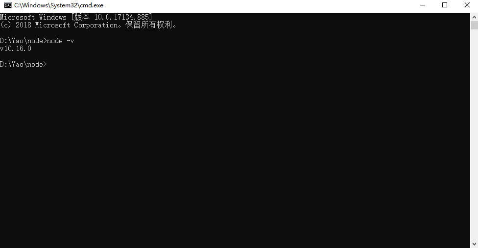
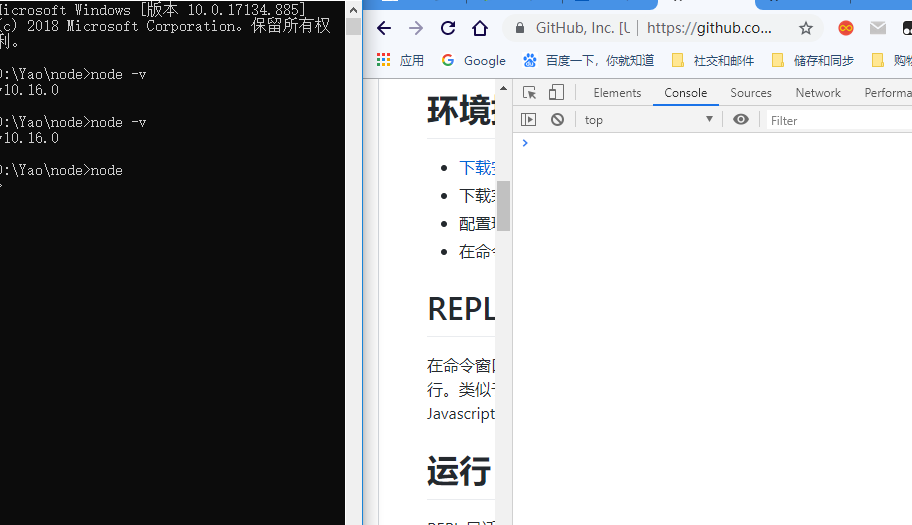
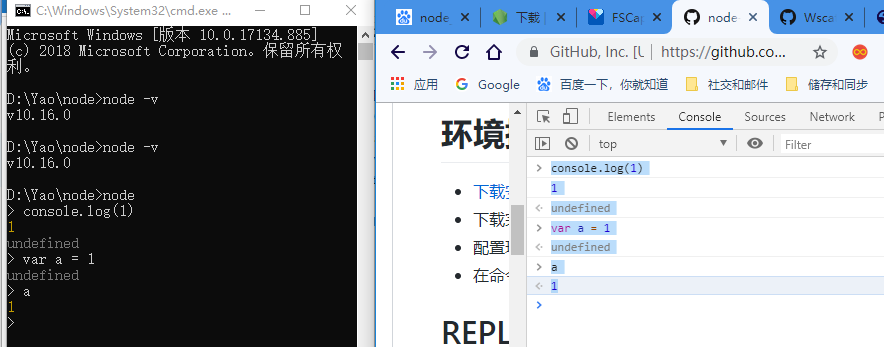
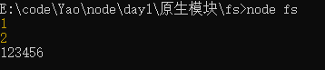

# Node详细文档

[Node文档](https://github.com/Wscats/node-tutorial)

# 第一门后端语言

系统环境WAMP (Win,Apache,Mysql,PHP)，包大于100M

Node的安装包17M

PHP后端语言

# Node介绍

Node的地位是跟PHP相似的

Node 是一个服务器端 JavaScript 解释器

Node是搞后端的，Node用JS写的

前端在开发的时候，你会用HTML,CSS,JS写好页面运行浏览器(Chrome)

Node其实就是把谷歌浏览器的引擎拿了出来，安装在系统上

你要跑一段JS，必须满足两个条件(你需要一份HTML，还要HTML把你这个JS引进来)

Node就是 想摆脱HTML和浏览器环境，独立生存。

那一天浏览器崩了，我们三兄弟也可以生存，把浏览器做了，把它的心脏（浏览器引擎）=》Node

Node诞生的十个年头，为了做后台，打PHP，压JAVA

# 优点

- Node.js 使用了一个事件驱动、非阻塞式 I/O 的模型，使其轻量又高效

# 安装

安装Node环境，其实就是把浏览器心脏拿出来u重新安装在电脑上

[Node官网下载地址](http://nodejs.cn/download/)

如果安装成功，你可以执行一下命令检查是否安装成功

```bash
node -v 
# 10.16版本
```




# 编写第一个Node程序



在以前我们运行JS代码，一般是用HTML把写好的JS引进来，然后用浏览器打开执行

所以我们Node也遵循这个方法，我们一般不会直接在控制台里面写这个代码，我们会写好一份JS代码 ，再交给 控制台运行



我们一般运行Node的JS会在命令行里面用Node加上文件的名字(可省略后缀)


```bash
node index
node index.js
```

Node其实就是JS把浏览器的控制台抽离出来，单独一个环境运行JS，而不需要借助浏览器环境和另外两门语言的协助(html,css)

既然Node没有HTML和CSS的协助，它也丧失了（DOM和BOM的能力）

Node没有所有的DOM和BOM，但是除了这两个之外JS本身应该有的它都有，JS真正变成一个最单纯的后端语言，而负责前端的JS其实就是比它多了和html和css交互的DOM和BOM


# REPL(交互式解释器)

跟你在浏览器控制台打代码没什么区别，唯独背景色是黑色区别于浏览器的白色

```js
var offset = 0;
setInterval(() => {
    console.log(offset++);
}, 1000)
```

暂停你的代码
```js
Ctrl+C
```

# Node.js 模块

模块系统是 Node.js 最基本也是最常用的。一般情况模块可分为四类：

- 原生模块 fs http ...
- 文件模块(属于原生模块，特殊的原生模块) fs
- 第三方模块
- 自定义模块

## 前端的模块化

```html
<!-- 封装好常用的BOM和DOM的功能，还有节点的增删改善 -->
<script src="jquery.js"></script>
<!-- 专门去写网页的一些交互逻辑，比如ajax数据请求 -->
<script src="index.js"></script>
<!-- 轮播图，滑块容器 -->
<script src="swiper.js"></script>
```


如果你不把这个JS分成一段段引入的话，全部逻辑写在同一份JS里面，那么首先维护成本很高，并且可识别度低

## 后端的模块化

html和css 还有bom和dom丢失了

利用`require`这个关键词去引入其他JS（模块），require.js

导入
```js
require()
```
导出
```js
module.exports = xxx
```

比如我们这里写入个例子，我们新建一份`index.js`，这是主入口，主逻辑文件，我们不可能逻辑写在这份文件里面，所以我们需要其他JS去辅助完成主要的功能，所以我把加法和减法分配给jquery去编写，此时jquery在后端就相当于一个独立模块，需要用require去吸收其他模块的功能，增强自身的能力
```js
// 导入建议写在最上面
// 把jquery的代码引入进来
var obj = require('./jquery.js')
// console.log(arr)
// console.log(arr[0](9, 16))
console.log(obj)
console.log(obj.plus(99, 55))
console.log(obj.sub(99, 55))
```
以下就是一份jquery.js文件，里面封装好了加法和减法，但是由于它是高度独立的模块，无法与index.js做关联，需要用关键词module.exports把该模块导出，方便其他模块调用
```js
function plus(a, b) {
    return a + b
}

function sub(a, b) {
    return a - b
}

// 导出建议写在代码最后一行
// 先把函数导出
// 导出一个函数
// module.exports = plus
// 导出一个对象，建议导出对象，面向对象编程
module.exports = { plus, sub }
// 导出一个数组
// module.exports = [plus]
```


# 原生模块

Node 牺牲了DOM和BOM的后端语言

JS语言给弱化，牺牲了DOM和BOM，增加了独有的新方法，补丁，ES6

原生模块就是帮JS赋予一些后端特性的功能

- [原生模块的官方文档](http://nodejs.cn/api/)

|JS|PHP|
|-|-|
|http(express)|apache|
|fs(mongodb)|mysql|
|net(socket.io)|websocket|

### fs(file system)文件系统模块

回想一下，以前JS在浏览器环境，是无法做到一件事件，那就是更改系统的一些文件，比如我不能在浏览器去对系统上的一些文件进行增删查改

原生模块不需要再导出，因为本身node就拥有的，原生不需要写引入的路径

```js
// 要写路径，模块是自己写的时候，才需要路径
var $ = require('./jquery.js')
// 原生模块由于是自带的，所以不需要路径后缀等，自己引入模块的名字即可
var fs = require('fs')
```

当我们打印这个fs变量的时候，发现导出是一个对象，并且对象里面有个规律，大部分每个函数里面都会对应xxx和xxxSync

以Sync结束都是同步方法，反之就是异步方法(async)

Node默认是支持异步的

前端三个主要的异步方法，同步编程其实是低效的
```js
XMLHttpRequest
setInterval
setTimeout
```

同步是阻塞的，低效，符合人类思维

异步是非阻塞的，高效，不符合人类思维
```js
// 异步一般都是两个特征的，第一是没有Sync，第二都要接受回调函数
fs.readFile(path[, options可选项], callback)
fs.readFileSync(path[, options])
```

回调函数里面一般监听两个变量，第一个变量一般都是监听错误的，因为异步，错误前置，你必须判断有没有报错，你好意思往下执行
```js
// 引入第一个原生模块
var fs = require('fs');
// 导出很多同步和异步方法
// console.log(fs);
console.log(1)
// 异步读取文件
// 异步不阻塞我们的程序
fs.readFile('../text.txt', {
    encoding: 'utf8',
    flag: 'r'
}, (err, data) => {
    console.log(data)
})

// 如果这里需要披萨
console.log(2)

$.ajax({
    success(data){

    }
})

console.log(data)
```

由于异步的原因，1是会被先打印，由于读是异步，所以不阻塞，也就是不等待，所以先打印的2，然后回调成功就再打印读成功的结果



写入数据

```js
const {
    writeFile
} = require('fs')

writeFile('../text.txt', 'hello world1213', (err, data) => {
    if (err) {
        console.log("写入失败")
    } else {
        console.log("写入成功")
    }
})
```

## http

http网络协议

就是我们前端要跟后端做通信的话，必须要借助http协议

客户端和服务端通信的最常见手段
```js

```


# 自定义模块

自己写的模块，称之为自定义模块

```js
// 要写路径，模块是自己写的时候，才需要路径
var $ = require('./jquery.js')
```

# 异步和同步

同步
```js
// 引入第一个原生模块
var fs = require('fs');
// 导出很多同步和异步方法
// console.log(fs);
console.log(1)

// 同步读 等待读取完成，才往下执行
var data = fs.readFileSync('../text.txt', {
    encoding: 'utf8',
    flag: 'r'
}, (err, data) => {
    console.log(data)
})

console.log(data)
```

同步和异步都可以有回调
- 同步的回调没意义
- 异步的回调有意义

- 异步有回调在于事情变高效，不浪费主线程的时间，不阻塞

比如我要去买一个披萨，披萨店老板告诉我，你要等待30分钟才可以拿到（花时间去做），留一个电话（回调函数），我可以走开做自己的事情，等到这个电话打回来，我才回去拿披萨

## 回调地狱(回调嵌套)

Promise解决

所以node使用大量的Promise来解决异步编程，比前端占比多很多

async和await的写法