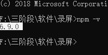
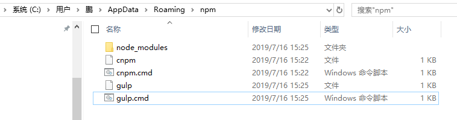

# 原生模块

http

熟悉http协议，http有哪些常用请求方法，http常用状态码(200,304,404,502)

||||
|-|-|-|
|1xx|请求预备阶段，链接没终止|不分手的协议|
|2xx|成功||
|3xx|重定向，缓存|一般我们请求都是向服务端发起的，设置缓存，它会重新去其他地方拿|
|4xx|客户端出问题了，404，链接写错了，服务器上根本没有这个资源|前端出问题了|
|5xx|服务器出问题了|后端出问题了|

createServer方法用于创建服务器，让JS真正变成后端语言，因为服务器是后端的最大标志

- 加载 http 模块
- 调用 `http.createServer()` 方法创建服务，方法接受一个回调函数，回调函数中有两个参数，第一个是请求体，第二个是响应体。
- 在回调函数中一定要使用 response.end() 方法，用于结束当前请求，不然当前请求会一- 直处在等待的状态。
- 调用 listen 监听一个端口。(选这个范围0~65535) 80 3306敏感的端口别去用 4000以上比较少存在重复 8000

创建第一个最简单的服务器，JS终于成为后端了
```php
header('Access-Control-Allow-Origin:*');
```
http.js
```js
var {
    createServer
} = require('http');
createServer((req, res) => {
    res.end('hello world!');
}).listen(12345);
console.log('启动服务器');
```

在终端命令行
```
node http
node http.js
```
```js
if(xhr.readState===4&&xhr.status==200){

}else{

}
```

# https

[https的服务器搭建](https://github.com/Wscats/node-tutorial/tree/master/server/httpsServer)

# 微信防撤回

前端：浏览器微信客户端
后端：NodeJS

微信接受到信息，然后通过在控制台调用ajax转送信息到NodeJS的服务器，服务器记录微信的聊天信息，对方就算把信息撤回了，服务器还是存在你的聊天信息

http模块负责创建服务器接收前端的ajax发过来的聊天纪录(服务器)

fs模块负责写入聊天信息记录(数据库)

利用DOM获取最新聊天记录
```js
var messages = $(".js_message_plain");
var news = messages.eq(messages.length-1).text();
```

把信息利用ajax发送给nodejs
```js
$.ajax({
    url:`http://localhost:12345/?message=${news}`,
    success(data){
        console.log(data)
    }
})
```

```js

```
不断监听，判断信息的长度，如果长度变大，那就是有信息传入
```js
var origin = 0;
var messages = 0;
var news = '';
setInterval(()=>{
    messages = $(".js_message_plain");
    if(messages.length>origin){
        news = messages.eq(messages.length-1).text();
        $.ajax({
            url:`http://localhost:12345/?message=${news}`,
            success(data){
                console.log(data);
            }
        })
        origin = messages.length;
    }else{
        console.log("没获取到新消息");
    }
},1000)
```

服务器接收信息
```js
var {
    createServer
} = require('http');
// req对应是前端给我的后端
// req我后端给前端的
createServer((req, res) => {
    console.log(decodeURI(req.url.split('=')[1]));

    // 控制响应头
    res.setHeader('Access-Control-Allow-Origin', '*');
    res.setHeader('name', 'yao');
    // 控制响应体
    res.write(`记录信息成功`)
    res.end();
}).listen(12345);
console.log('启动服务器');
```
并且写入本地文档
```js
var {
    createServer
} = require('http');
var {
    appendFile
} = require('fs');

var appendMessage = (url, data) => {
    return new Promise((resolve, reject) => {
        appendFile(url, `${data}<br/>`, (err) => {
            if (err) {
                reject(err);
                throw err;
            } else {
                resolve();
                console.log('数据已追加到文件');
            };
        });
    })
}
// req对应是前端给我的后端
// req我后端给前端的
createServer(async (req, res) => {
    let message = decodeURI(req.url.split('=')[1]);
    console.log(decodeURI(req.url.split('=')[1]));
    // 写入文档
    await appendMessage('./messages.html', message);
    // appendFile('messages.txt', message, (err) => {
    //     if (err) throw err;
    //     console.log('数据已追加到文件');
    // });
    // 控制响应头
    res.setHeader('Access-Control-Allow-Origin', '*');
    res.setHeader('name', 'yao');
    // 控制响应体
    res.write(`记录信息成功`)
    res.end();
}).listen(12345);
console.log('启动服务器');
```

总结：

- node在这里可以充当一个服务器，接受前端请求
- 并且可以返回响应信息给前端，处理请求信息把它做一些增删查改

# 第三方模块

安装node环境，使用npm命令安装gulp模块，压缩合并重命名转化代码

node自带的命令，如果你成功安装node的话，你的命令行会自带npm命令，你可以检查你的电脑是否安装npm



```bash
npm install gulp
```

## 什么是npm

npm就是一个现代化的模块开源市场，里面有很多人写好的其他人写的JS模块

我们不可能所有的东西(模块)都是自己，开发成本和时间成本，为了这个开发效率，JS就诞生了一个维护JS模块的地方，这个地方形成做一个市场，而这个市场就叫npm

不是node自带，其他人写的，我们只要知道其他人写的这个模块名字，我们就可以用npm这个命令安装该模块，所有的模块都是免费的

```bash
# 安装某一个，多个模块
npm i xxx
npm install xxx xxx xxx
# 既安装jquery又安装gulp
npm install jquery gulp

## 卸载模块
npm uninstall jquery gulp
```

## package.json

`JSON.stringify`和`JSON.parse`

我可以使用一个npm init创建一个package.json文件，因为里面可以记录下该项目的详细信息，我用了那些模块开发，它的启动命令是什么的，它的开发者有哪些，它的插件名字
```json
{
  "name": "yao",
  "version": "5.2.0",
  "description": "这是一个描述文件",
  "main": "index.js",
  "scripts": {
    "test": "echo \"Error: no test specified\" && exit 1"
  },
  "keywords": [
    "cool",
    "amazing"
  ],
  "author": "eno yao",
  "license": "MIT"
}
```
以后如果你需要使用node开发项目，一般建议你在项目的根目录下初始化一份`package.json`文件

```bash
# 生产依赖 前端必须要的 前端要后端不要那就--save
npm install jquery --S
npm install jquery --save
# 开发依赖 后端必须要的 后端需要前端不需要那就save-dev
npm install jquery --D
npm install gulp --save-dev
# 指定版本 如果不指定版本默认最新
npm install jquery@1.3.6
```
由于刚才在安装的时候加了--save所有`package.json`把jquery这个依赖模块给记录下来
```json
{
  "name": "yao",
  "version": "5.2.0",
  "description": "这是一个描述文件",
  "main": "index.js",
  "scripts": {
    "test": "echo \"Error: no test specified\" && exit 1"
  },
  "keywords": [
    "cool",
    "amazing"
  ],
  "author": "eno yao",
  "license": "MIT",
  "dependencies": {
    "jquery": "^3.4.1"
  }
}
```

## 全部依赖安装

你可以在`package.json`所在目录打开命令行，执行`npm install`把所有依赖还原回来
```bash
npm install
```

## npm run xxx

运行`npm run start`启动`package.json`所记录的命令
```json
"scripts": {
    "test": "echo \"Error: no test specified\" && exit 1",
    "start": "dir"
},
```

# cnpm

淘宝，阿里搞得一个国内镜像

- [淘宝镜像官方文档](http://npm.taobao.org/)

如果安装完之后会产生一个新的命令的时候那就需要-g，全局安装其实就是为了产生一个全局命令


就是把node_modules安装在类似的目录下，会在全局目录下产生一些xxx.cmd的文件



> C:\Users\鹏\AppData\Roaming\npm
```bash
npm install -g cnpm --registry=https://registry.npm.taobao.org
```

# yarn

facebook搞的
```bash
npm install -g yarn
```
[安装](https://yarn.bootcss.com/docs/install/#windows-stable)

# request

除了gulp之外，第二个第三方模块

首先安装request
```bash
npm i request
npm install request
```

引用第三方模块也是不需要加路径，只需要引入模块的名字就可以了，引入第三方模块它会自动寻找该目录下的node_modules文件夹，如果没有再往父级目录，如果再没有那就往全局寻找

```js
var request = require('./node_modules/request'); //不建议
var request = require('request'); // 建议
```
使用了这个第三方模块爬取网站的源码信息
```js
// var request = require('./node_modules/request');
var request = require('request');
var fs = require('fs');
// 请求一个路径，把数据请求到node端显示
// response响应头
// body    响应体
request('https://588ku.com/?h=bd&sem=1', function (error, response, body) {
    console.log('error:', error); // Print the error if one occurred
    console.log('statusCode:', response && response.statusCode); // Print the response status code if a response was received
    console.log('body:', body); // Print the HTML for the Google homepage.
    fs.writeFile('./index.html', body, (err, data) => {
        if (err) throw err;
        console.log("写入成功");
    })
});
```

# jquery 和 jsdom

用正则获取所有的img的src信息，或者jquery配合jsdom来获取爬取回来的信息的图片路径，由于jquery是不能直接用在node，所以根据jquery的node文档，需要用jsdom来模拟一个dom和bom使用
```js
const jsdom = require("jsdom");
const { JSDOM } = jsdom;
const { window } = new JSDOM(`<!DOCTYPE html><p>Hello world</p>`);
const $ = require("jquery")(window);
```
把页面所有的信息分析出来
```js
const request = require('request');
const fs = require('fs');
const jsdom = require("jsdom");
const {
    JSDOM
} = jsdom;
request('https://588ku.com/?h=bd&sem=1', function (error, response, body) {
    const {
        window
    } = new JSDOM(body);
    const $ = require("jquery")(window);
    $('img').each((index, ele) => {
        console.log($(ele).attr('src'));
    })
});
```
爬取页面的所有图片并且批量下载到本地
```js
const request = require('request');
const fs = require('fs');
const jsdom = require("jsdom");
const {
    JSDOM
} = jsdom;
request('http://www.umei.cc/p/gaoqing/cn/', function (error, response, body) {
    const {
        window
    } = new JSDOM(body);
    const $ = require("jquery")(window);
    $('img').each((index, ele) => {
        let src = $(ele).attr('src')
        console.log(src)
        request(encodeURI($(ele).attr('src'))).pipe(fs.createWriteStream(`./imgs/${index}.png`))
    })
});
```
