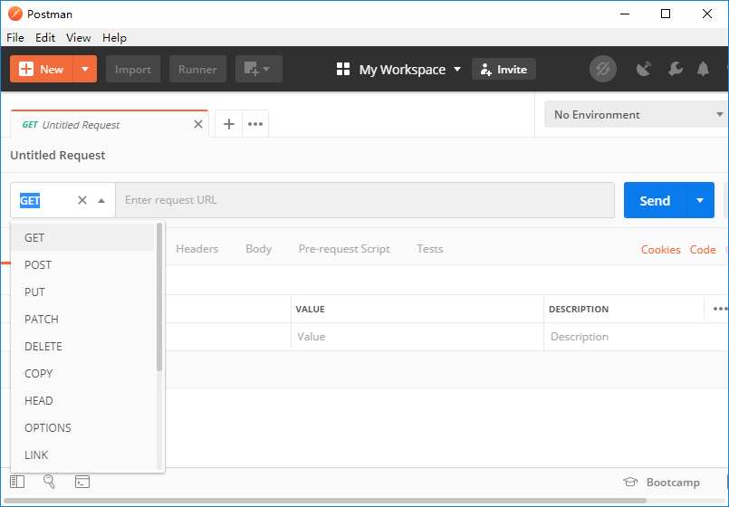
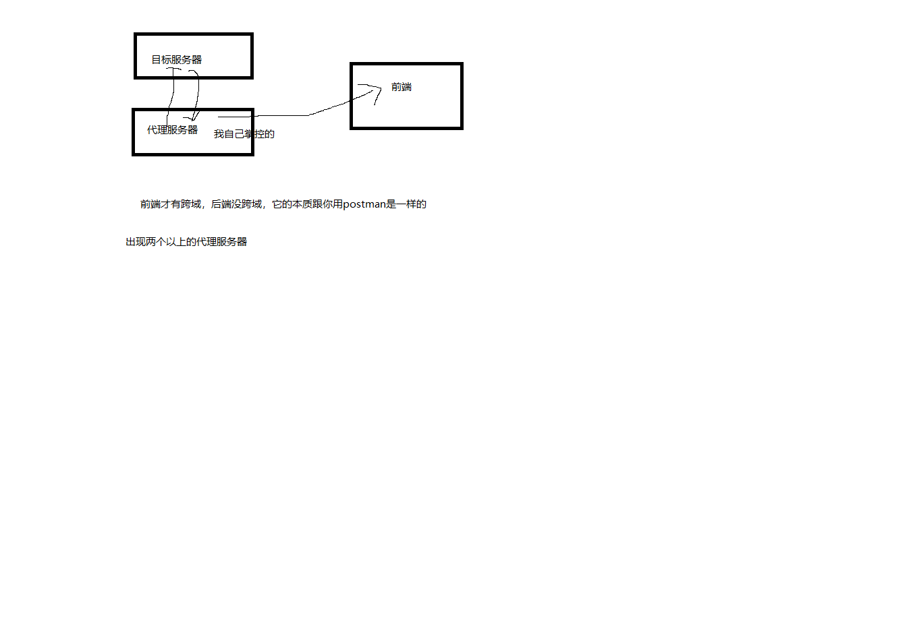

# http -> express

http 是原生模块，express 是帮你做了http添砖加瓦，做完了一个后端该有的一个框架

express 前端遇到第一个框架，它不是前端框架，它要活在node里面，所以它其实后端框架

框架->图纸  库->工具

express    jquery

express提供思路 不提供方法

jquery提供方法 不提供思路

# express

详细的API

[官方中文文档](http://www.expressjs.com.cn/)

[Express NPM文档](https://www.npmjs.com/package/express)

express也是一个第三方模块，它不是我写的，第三方写的

npm搞回来 

```bash
npm install express --save
```

- 加载模块
```js
var express = require('express');
```

- 初始化express，让诞生第一个项目的对象

```js
const app = express()
```

- 后端路由

定义一个路由

发送一个get请求: http://localhost:12345/home

发送一个post请求: http://localhost:12345/setting

支持链式调用

新建是一份`server.js`
```js
app.get('/home', (req, res) => res.send('Hello World!'))
app.post('/setting', (req, res) => res.send('Hello World!'))
app.delete('/setting', (req, res) => res.send('Hello World!'))
app.copy('/setting', (req, res) => res.send('Hello World!'))
app.put('/setting', (req, res) => res.send('Hello World!'))// 
监听一个端口
app.listen(12345)
```

一般情况


后端给前端，那就get，前端问后端拿数据就用get

前端交数据，那就post

|前端|-post->|后端|
|-|-|-|
|前端|<-get-|后端|


- 启动服务器

在终端中输入
```
node server
```

put,post,get,delete就是我们RESTful规范，建立在http协议上


如果一个后端，你要给我一个接口


知道用什么请求方法，请求的路径和端口，请求的参数，响应的数据结构

# 接口文档

- 产品需求文档
- 设计文档
- 测试文档
- 接口文档

|协议|域名|端口|路由|参数|哈希|类型|
|-|-|-|-|-|-|-|
|http|localhost|12345|/home|?name=xxx&&age=xxx|#xxx|GET|

示例接口


# Postman

[Postman官网下载](https://www.getpostman.com/downloads/)



你在开发的时候先拿到后端接口，用postman测试该接口是否可行，如果可行，记录下来用于开发，否则去找后端商量问题所在，在用于前端开发

postman不会跨域，它其实是基于类似node这种后端平台开发的

你再去用ajax请求解决跨域问题去后端拿对应的数据

# 跨域

跨域一定要两厢情愿

- jsonp
- CORS方法(最简单粗暴的)
```js
res.append('Access-Control-Allow-Origin', '*')
```
- 服务器代理(这种是可以前端单独拿来解决跨域)



你如果要去拿数据，如果目标服务器的数据你不能直接拿，找另外一个服务器出来(充当第三者)，而这个第三者服务器控制权在我手上。

# 登陆注册

需求要求

- 前端

有两个以上的输入框，一个是输账号，一个输密码，还有一个登陆按钮，点击登陆的时候把账号和密码发送给后端，后端判断账号和密码是否跟数据库对比，如果账号和密码一致，那响应信息给前端，登陆成功

前端主要发送ajax请求携带账号和密码

```html
<input type="text" />
<input type="password" />
<button>登陆</button>
```
```js
$.ajax({
    type: "POST",
    url: "http://localhost:9999/login",
    data: {
        username: $("#u").val(),
        password: $("#p").val()
    },
    success(data) {
        resolve(data);
    },
    error(err) {
        reject(err);
    }
})
```

- 后端

接收前端的账号和密码，跟数据库判断，并响应结果
```js
var bodyParser = require('body-parser');
app.use(bodyParser.urlencoded({
    extended: false
}));
app.post((req,res)=>{
    // 后端根据bodyParser解析出来的请求体，获取账号和密码做判断
    let {
        u,
        p
    } = req.body
})
```

## express处理body部分post请求

除非你用原生方法去获取，否则你需要`body-parser`去处理

因为post请求他跟这个get请求区别在于post请求的请求体会携带大量的数据(文本，视频，音频和图片)，post请求为什么适合带数据，请求体的数据会以流的方式流进这个node的req

`req`数据流，它会监听数据的流入，先定义一个空的容器，
```js
(req, res) => {
    let body = '';
    // 监听数据正在流入
    req.on('data', (chunk) => {
        body = body + chunk;
    })
    // 监听数据流动结束
    req.on('end', () => {
        console.log(body);
    })
}
```

```js
// 该app对象调用其他模块来去处理请求和响应
app.use(bodyParser.urlencoded({
    extended: false
}));
```


## express的get请求

req.query获取，它是不需要单独处理，express帮你解决了

