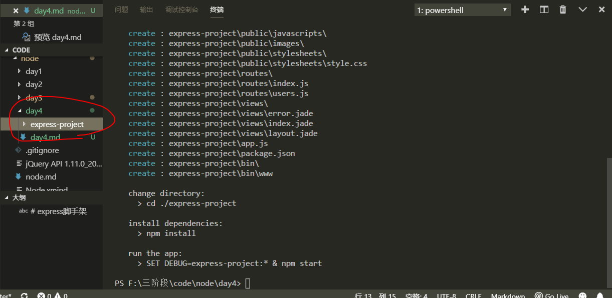
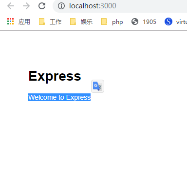
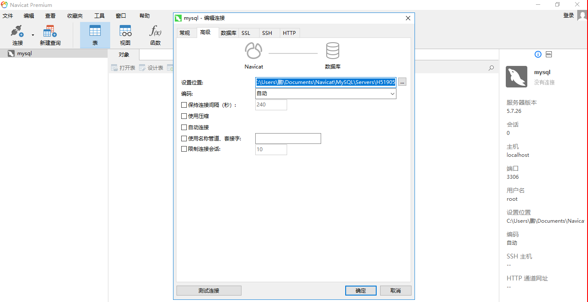

# express脚手架

express在开发这里面，官方提供一个一体化的平台，是因为人家可以定制化，一键构建最简单后端开发模型

由于成本上的问题，框架给你提供了一个脚手架（集成环境）环境开发

全局安装脚手架的指令
```bash
npm install -g express-generator@4
```
如果安装成功，会在全局拥有一个express的命令
```bash
# 创建一个项目
express 建议相对路径
express ./express-project
```


进入express-project目录安装依赖
```bash
cd express-project
npm install
# 建议使用淘宝镜像
cnpm install
```
安装依赖成功
```bash
npm run start
# start命令的简写
npm start
```
在浏览器访问http://localhost:3000，如果成功就会看到以下网页内容



# 目录结构

- bin 启动文件 node ./bin/www 里面用了http模块实现了服务器，所以express服务器本质是建立在http原生模块上，可以更改端口号
- node_modules 项目的其他依赖
- public 静态资源文件夹(里面会放前端的东西，比如页面，JS，样式，HTML,CSS,JS,IMG)
- routes 路由文件夹 类似处理这种app.post app.get
- views 视图层
- app.js 主逻辑文件，一般来说改动会比较少，它是配合路由更改
- package.json 项目描述文件


我们以前所有的项目都是前后端分离，但是express前后端一体化

```jade
doctype html
html
  head
    title= title
    link(rel='stylesheet', href='/stylesheets/style.css')
  body
    block content
```

scss是css的预编译语言，最终还是生成css
jade是html的预编译语言，最终还是生成html

typescript-es6->js


html5语义化


# app.js

app.js是为./bin/www服务的
```js
// 创建错误 404,502错误
var createError = require('http-errors');
var express = require('express');
// 是node的原生模块
var path = require('path');
// 解析cookie的
var cookieParser = require('cookie-parser');
// 打印的模块 打印一些请求结果在终端上 打印日志
var logger = require('morgan');

// 路由
var indexRouter = require('./routes/index');
var usersRouter = require('./routes/users');

var app = express();


// 中间件
// view engine setup
// 设置视图文件夹
app.set('views', path.join(__dirname, 'views'));
// 设置html预编译语言为jade，还有其他语言的 sass less
app.set('view engine', 'jade');

app.use(logger('dev'));
app.use(express.json());
app.use(express.urlencoded({ extended: false }));
app.use(cookieParser());
app.use(express.static(path.join(__dirname, 'public')));

app.use('/', indexRouter);
app.use('/users', usersRouter);

// catch 404 and forward to error handler
app.use(function(req, res, next) {
  next(createError(404));
});

// error handler
app.use(function(err, req, res, next) {
  // set locals, only providing error in development
  res.locals.message = err.message;
  res.locals.error = req.app.get('env') === 'development' ? err : {};

  // render the error page
  res.status(err.status || 500);
  res.render('error');
});

module.exports = app;

```

# path

path是原生模块，用于拼接路径，[path官方文档](http://nodejs.cn/api/path.html#path_path_join_paths)

```js
var path = require('path');
let p = path.join('/foo', 'bar', 'baz/asdf', 'abc', './');
console.log(p)
path.join(__dirname, 'views')
```

# __dirname

当前模块的目录名

[__dirname](http://nodejs.cn/api/globals.html)

返回一个绝对路径
```bash
F:\三阶段\code\node\day1\原生模块\path\foo\bar\baz\asdf\abc\
```

# mysql

数据库


其他数据库 oracle,access,mongodb,excel

连接数据库，在我们以前php，因为它自带了和mysql操作的方法，nodejs不会自带mysql的方法，但是它可以通过第三方模块来去控制

[mysql的npm文档](https://www.npmjs.com/package/mysql)

安装mysql模块
```bash
npm install mysql
```
新建一份server.js
```js
var mysql = require('mysql');
var connection = mysql.createConnection({
    host: 'localhost',
    user: 'root',
    password: '',
    // 数据库名字
    database: 'baiyangwang'
});
// 执行连接
connection.connect();

connection.query('SELECT 1 + 1 AS solution', function (error, results, fields) {
    if (error) throw error;
    console.log('The solution is: ', results[0].solution);
});
// 执行关闭
connection.end();
```
正常的数据库，连接完成后会关闭

如果使用的可视化软件，注意编码格式



mysql模块调用fs模块，fs模块上层建筑

# 池连接

数据池连接，没有这个连接和中断
```js
var mysql = require('mysql');
var pool = mysql.createPool({
    connectionLimit: 10,
    host: 'localhost',
    user: 'root',
    password: '',
    database: 'test'
});

pool.query('SELECT * FROM students', function (error, results, fields) {
    if (error) throw error;
    console.log('The solution is: ', results[0].solution);
});
```
下面这些代码，这个比较稳
```js
var mysql = require('mysql');
var pool = mysql.createPool({
    connectionLimit: 10,
    host: 'localhost',
    user: 'root',
    password: '',
    database: 'test'
});
// 连接池可以执行连接和释放
pool.getConnection(function (err, connection) {
    if (err) throw err; // not connected!
    // Use the connection
    connection.query('SELECT something FROM sometable', function (error, results, fields) {
        // When done with the connection, release it.
        connection.release();
        // Handle error after the release.
        if (error) throw error;
        // Don't use the connection here, it has been returned to the pool.
    });
});
```
可以在sql语句里面放入?，这里可以代替字符串和键值对
```js
connection.query('INSERT INTO students SET ?', [{
    name: '琳姐'
}], function (error, results, fields) {
    console.log(results);
    // When done with the connection, release it.
    connection.release();
    // Handle error after the release.
    if (error) throw error;
    // Don't use the connection here, it has been returned to the pool.
});
```

# 封装数据库的增删改查

```js
var mysql = require('mysql');
var pool = mysql.createPool({
    connectionLimit: 10,
    host: 'localhost',
    user: 'root',
    password: '',
    database: 'test'
});
const getConnection = () => {
    return new Promise((resolve, reject) => {
        // 连接池可以执行连接和释放
        pool.getConnection(function (err, connection) {
            if (err) {
                reject(err);
                // not connected!
                throw err;
            } else {
                resolve(connection);
            }
        });
    })
}
const query = (connection, sql, params) => {
    return new Promise((resolve, reject) => {
        // Use the connection
        connection.query(sql, [params ? params : ''], function (error, results, fields) {
            console.log(results);
            // When done with the connection, release it.
            connection.release();
            // Handle error after the release.
            if (error) {
                reject(error);
                throw error;
            } else {
                resolve(results);
            };
            // Don't use the connection here, it has been returned to the pool.
        });
    })
}
const find = async (table, params) => {
    const connection = await getConnection();
    if (params) {
        return await query(connection, `SELECT * FROM ${table} where ?`, params);
    } else {
        return await query(connection, `SELECT * FROM ${table}`, null);
    }

}
module.exports = {
    find
}
```

# 配合express

后端你要给我一个接口，这个接口需要我查找学生的信息

GET： http://localhost:3000/students/find?id=xx

GET：http://localhost:3000/students/find?name=xx

后端返回一个数据结构

```json
{
    status:'success',
    name:xxx,
    id:xxx
}
```

在routes文件夹里面新增一份路由students.js
```js
var express = require('express');
var router = express.Router();

router.get('/find', function (req, res, next) {
    // 再找views里面index.jade
    res.send('stu')
});

module.exports = router;
```

在app.js中加载该路由，新增一个新的中间件
```js
var studentsRouter = require('./routes/students');
app.use('/students', studentsRouter);
```

在express项目中安装mysql模块
```js
npm install mysql --save
```
引入我们封装好的db.js自定义操作数据库的模块
