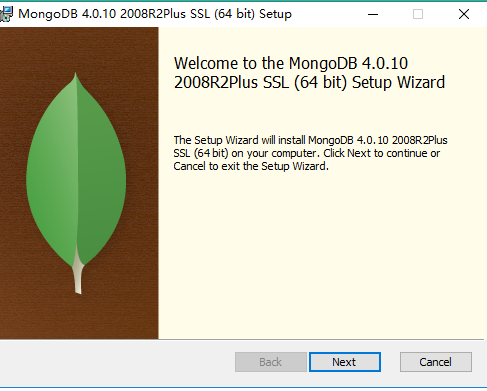
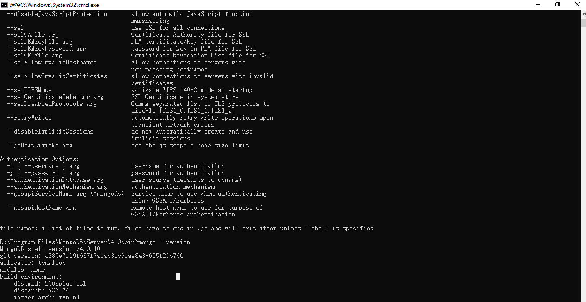
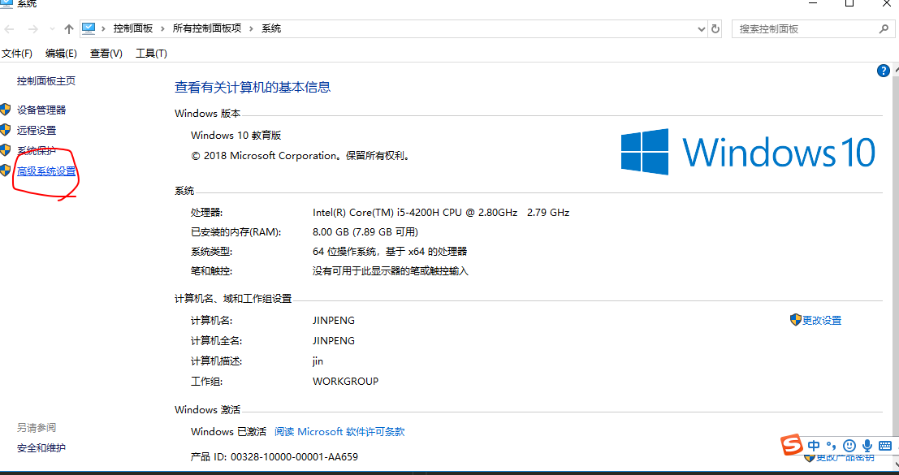
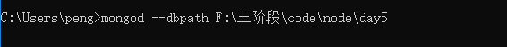
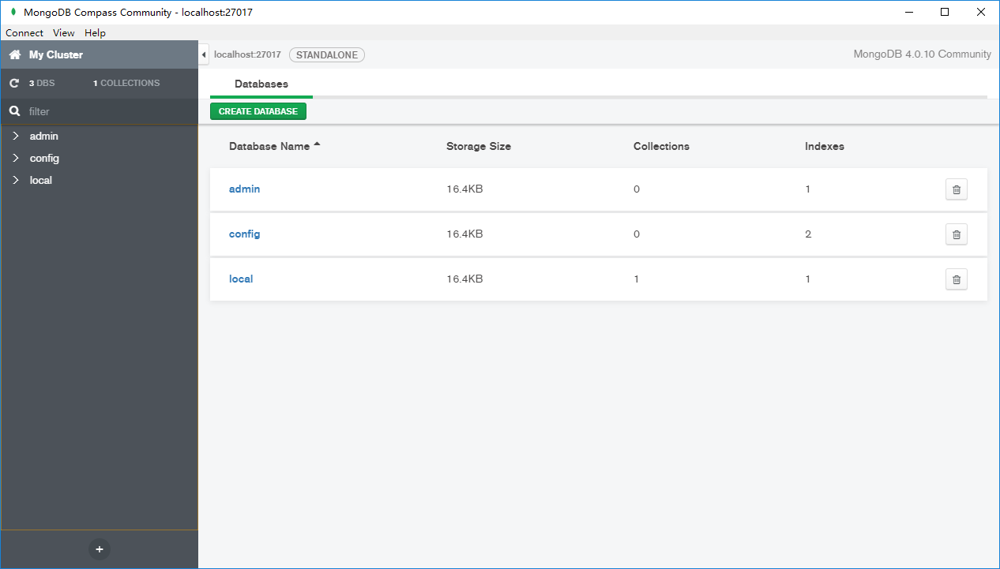
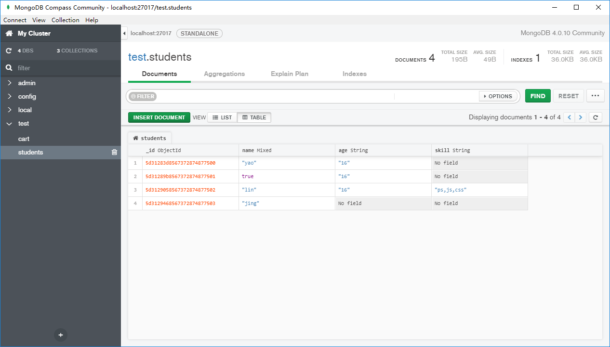

# mongodb

本质上fs模块，对硬盘的读写

在js比较流行，[官网下载地址](https://www.mongodb.com/download-center/community)

安装



进入mongodb的安装目录的bin文件夹，里面有mongodb的命令

> D:\Program Files\MongoDB\Server\4.0\bin

你可以在这里打开cmd

```bash
mongo --version
```



你可以在环境变量里面设置这个变量



进去选高级->环境变量->系统变量->Path->新建您的mongo bin路径

# 可视化工具

[Robo 3T](https://studio3t.com/download-thank-you/?OS=win64)

# 新建/连接数据库

所以在bin文件夹下找到mongod.exe命令，然后通过管理员执行`mongod --dbpath x`路径x，路径可以是任何地方，我这里选择在D盘的MongoDB目录下，当然路径不要包含特殊的字符串，比如Program Files (x86)也不行

```
mongod --dbpath D:\mongodb\data\db\database
```

这句命令用于创建数据库，并且打开端口27017，然后

> http://localhost:27017



用compress的可视化界面，连接



mongodb是有库的概念，也有集合的概念，集合相当于mysql中的表

先设计表结构，设计name字段，数据类型

但是在mongodb里面，集合是不需要设计，它可以用任意的类似json结构表示，数据结构是可以混合的，不一定按照唯一的数据结构



# node 连接 mongodb


[mongodb的官网](https://www.npmjs.com/package/mongodb)

安装mongodb模块
```bash
npm install mongodb --save
```

实现最基本的CRUD增删改查操作

新建一份app.js
```js
const MongoClient = require('mongodb').MongoClient;
// 踊跃测试
const assert = require('assert');
 
// Connection URL
const url = 'mongodb://localhost:27017';
 
// Database Name
const dbName = 'test';
 
// Use connect method to connect to the server
MongoClient.connect(url, function(err, client) {
  if(err!==null) throw err;
  assert.equal(null, err);
  console.log("Connected successfully to server");
  // 选中需要连接的库
  const db = client.db(dbName);
  // 选中表
  const collection = db.collection('students');
  // Find some documents
  collection.find({}).toArray(function(err, docs) {
    assert.equal(err, null);
    console.log("Found the following records");
    console.log(docs)
  });
  // 关闭连接
  client.close();
});
```
运行代码
```bash
node app.js
```

# 断言的测试模块 assert


[assert](https://nodejs.org/dist/latest-v10.x/docs/api/assert.html)是node的原生模块，用于代码测试

判断1是否完全等于2，如果错误的话，抛出错误
```js
var assert = require('assert');
// 如果这里判断有问题，会在这里中断
assert.strictEqual(1, 1);
```

# NoSql

mongodb去除sql语句存在的，你要利用mongodb给你封装好的方法来去实现类似sql的操作

- 查
```js
collection.find({ a : 2 })
// 全找
collection.find()
```
- 改

寻找要改的那一条 找a=2的那一条，把里面的b改为1
```js
collection.updateOne({ a : 2 }, { $set: { b : 1 } }
```

- 删

```js
collection.deleteOne({ a : 3 })
```

- 增

```js
collection.insertMany([{a : 1}, {a : 2}, {a : 3}])
```

# 查询ID

查询自动生成的ObjectId
```js
var ObjectId = require('mongodb').ObjectId;
let _id = ObjectId("5bcae50ed1f2c2f5e4e1a76a");
db.collection('xxx').find({
    "_id": _id
}).forEach(function (item) {
    console.log(item)
})
```

# 详细的文档

[Mongodb](https://github.com/Wscats/node-tutorial/issues/20)


# Bootstrap

Bootstrap 是全球最受欢迎的前端组件库，用于开发响应式布局、移动设备优先的 WEB 项目。

Bootstrap 是一套用于 HTML、CSS 和 JS 开发的开源工具集。利用我们提供的 Sass 变量和大量 mixin、响应式栅格系统、可扩展的预制组件、基于 jQuery 的强大的插件系统，能够快速为你的想法开发出原型或者构建整个 app 。

精髓：复制粘贴

Ctrl+C Ctrl+V

# 关于开发中的跨域问题

因为前后端是分离的，所以前后端不同作用域，会出现跨域

以express为例，我们可以把前端所有的文件放进express的public静态文件夹里面，那此时这个前端页面可以通过express的端口去访问

在测试的时候可以前后端分离用cors解决跨域

在发布的时候，前后端同服务器下，可以跨域，后端cors